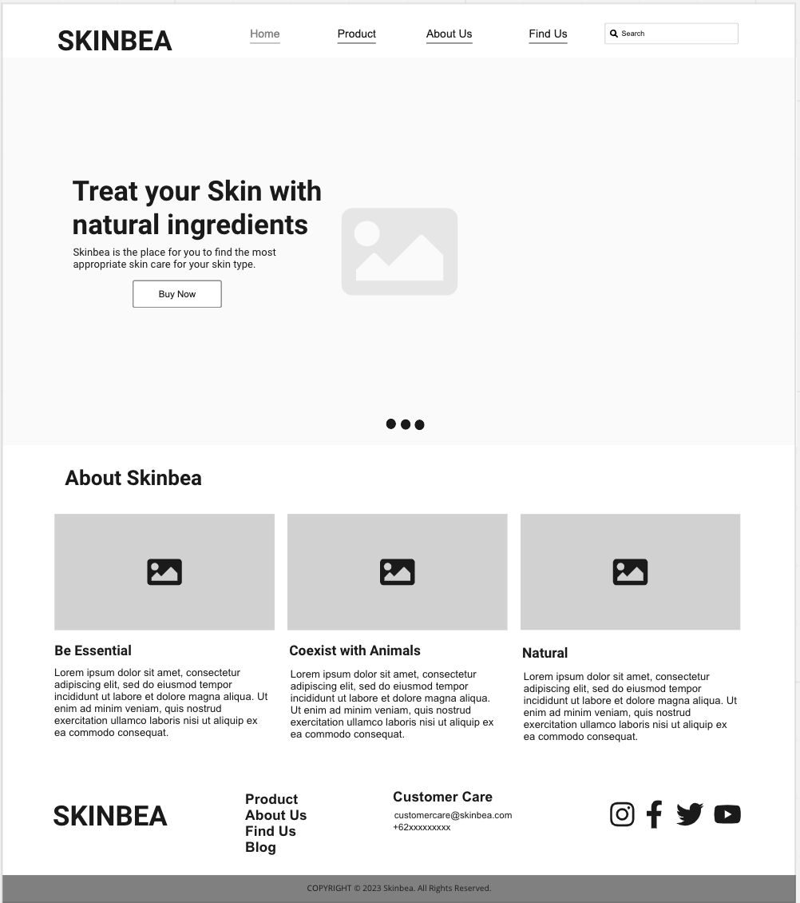
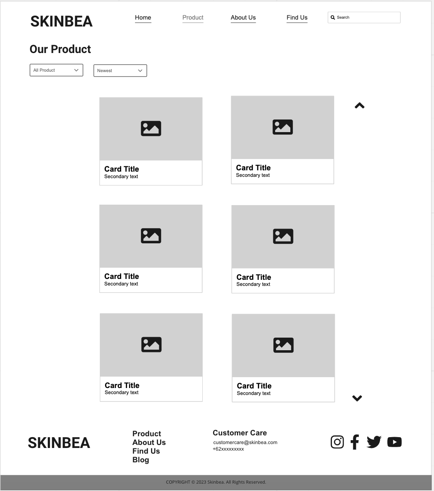
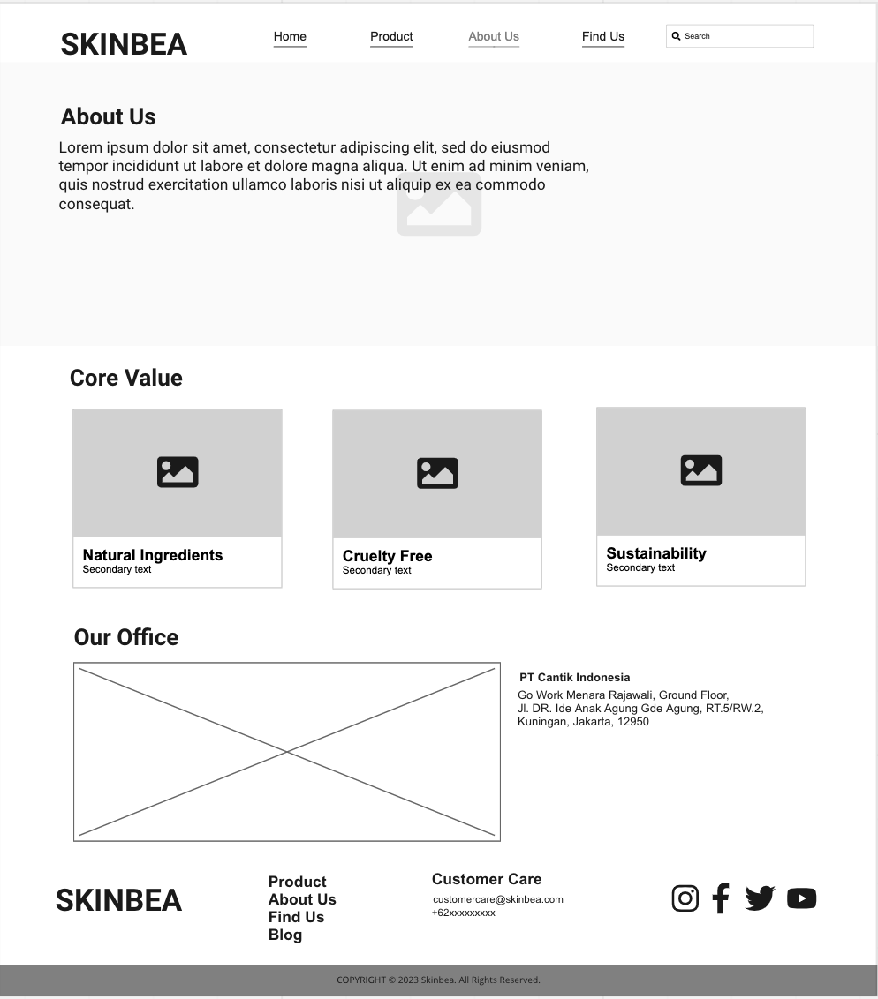
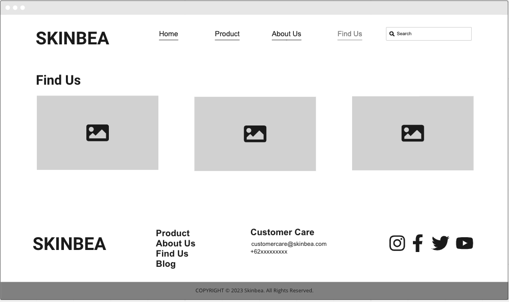
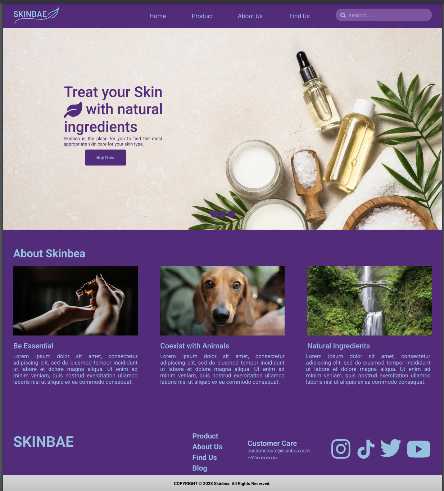
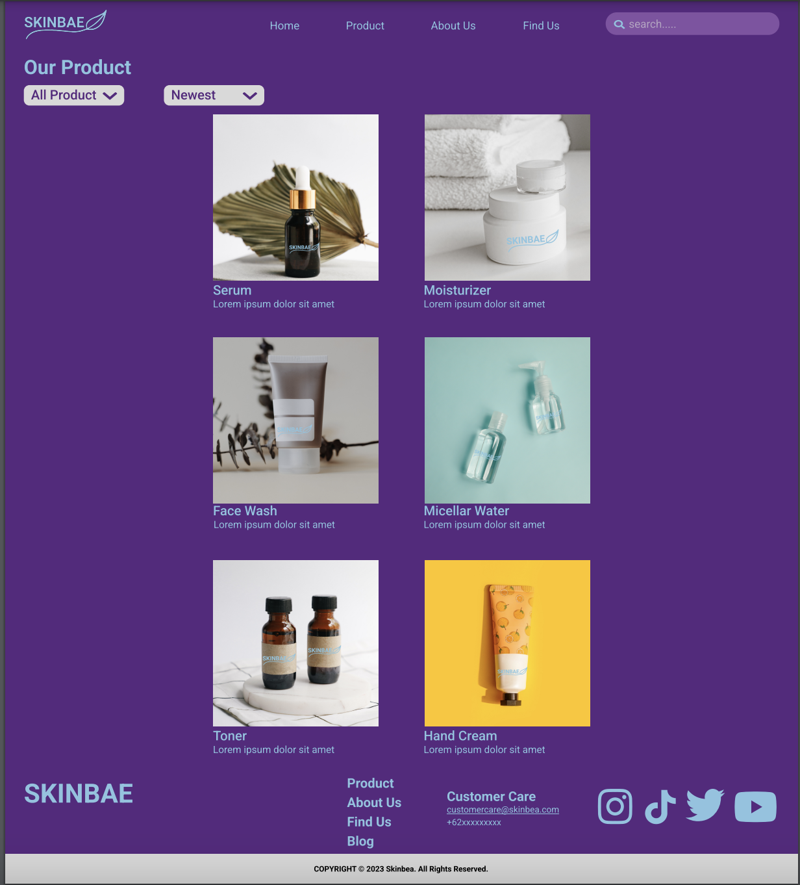
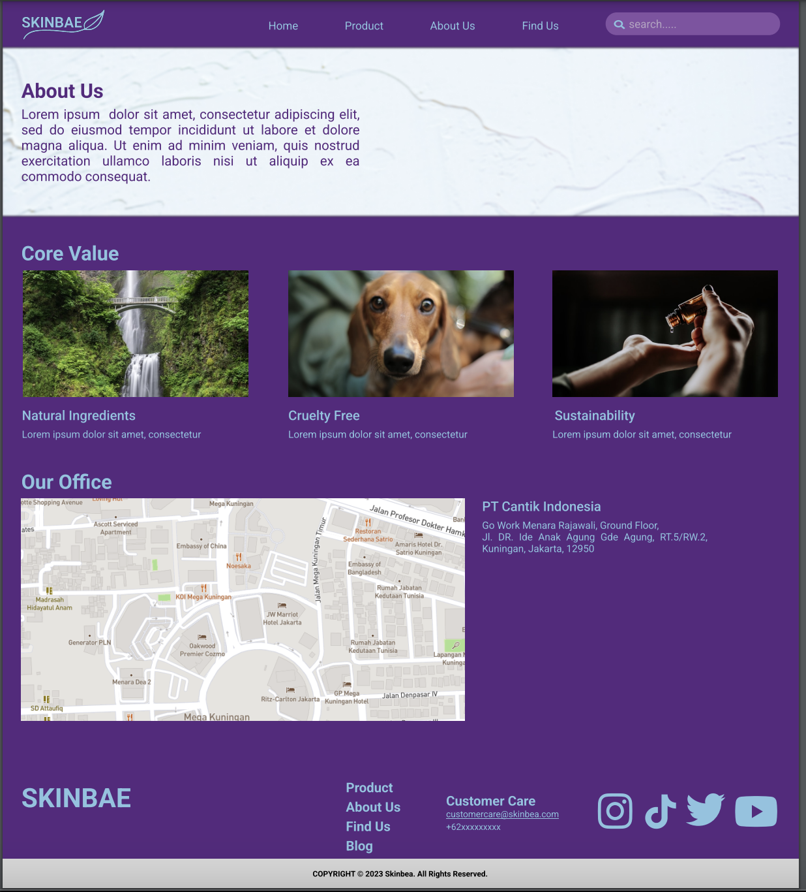
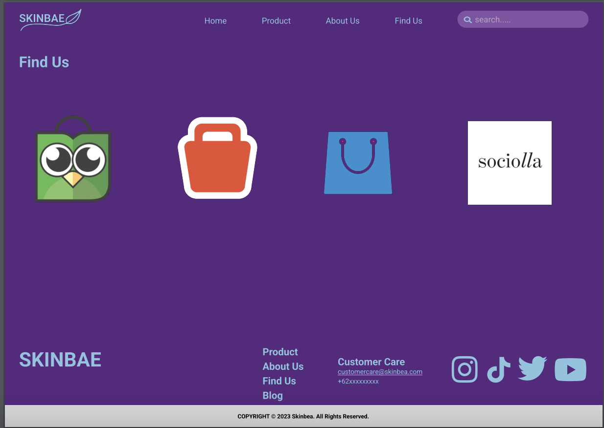

# UI UX

> This is an assignment for UI UX

Link Figma: <https://www.figma.com/file/6R1rByO9fuzkpTCSRxxDoz/SKINBEA?node-id=25%3A65&t=UweBGYshz7SjuTL2-1>

Link Miro: <https://miro.com/app/board/uXjVPunZibc=/?share_link_id=717040422732>

Inspiration: <https://dribbble.com/>
Inspiration: <https://colorhunt.co/>
Inspiration: <https://unsplash.com/>
inspiration: <https://www.klairscosmetics.com/>
inspiration:<https://www.carasunbeauty.com/>

## Screenshots

### Miro (Wireframe)

### Figma (Mockup and Prototyping)

